# Operationalizing Machine Learning

The goal of this project is to create, deploy and consume the best model that predicts if the client will subscribe a term deposit (variable y).

We analyze the bankmarketing dataset and apply classification models using AutoML Azure Machine Learning Tool.

At the end we will create and publish a pipeline with all of the necessary steps that allows the on-demand subscription of the whole process.

## Architectural Diagram

The project is configured in the following steps:

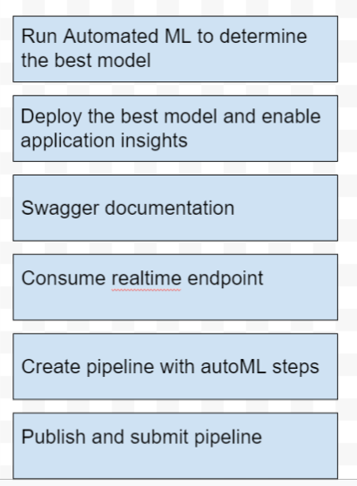

## Key Steps

1. Upload Bankmarketing dataset from file
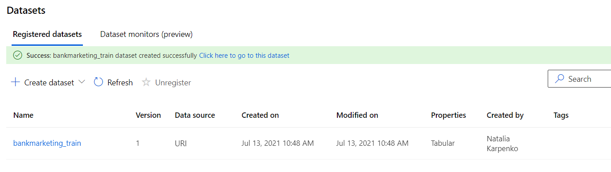

2. Create and run AutomatedML experiment
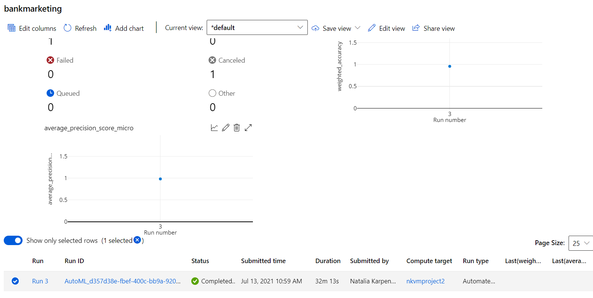

3. Retrive the best model
The best model is VotingEnsemble with 91,7% of accuracy
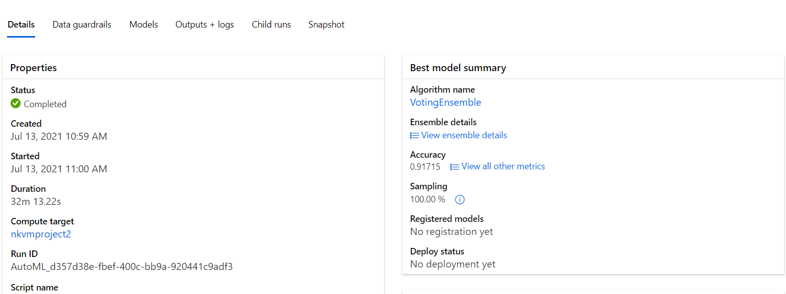

4. Deploy the best model with Azure Container Instance
TODO: inserire deploy_best_model
5. Enable Application Insights (screan application and log)
I enabled application insights changing file logs.py: added settings enable_app_insights=True

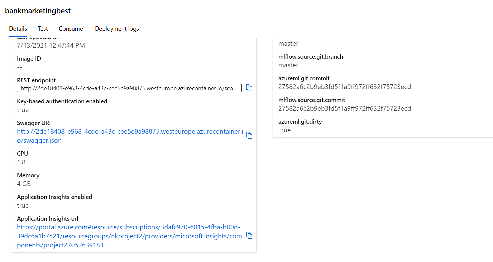
The screen showing logs:
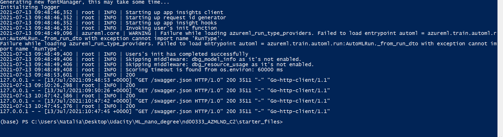

6. Display the contents of the API for the model in swagger instance (swagger runs)
Swagger documentation allows us to have all of the necessary information to consume the model:
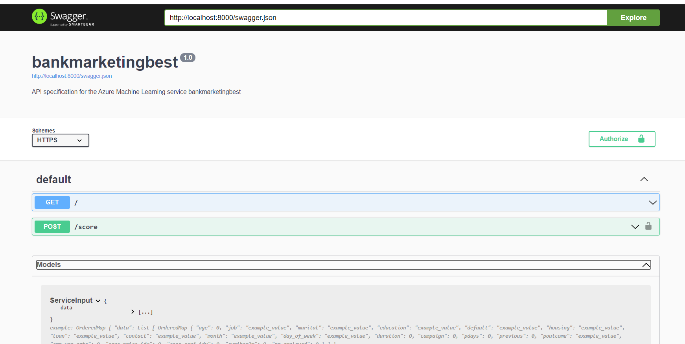
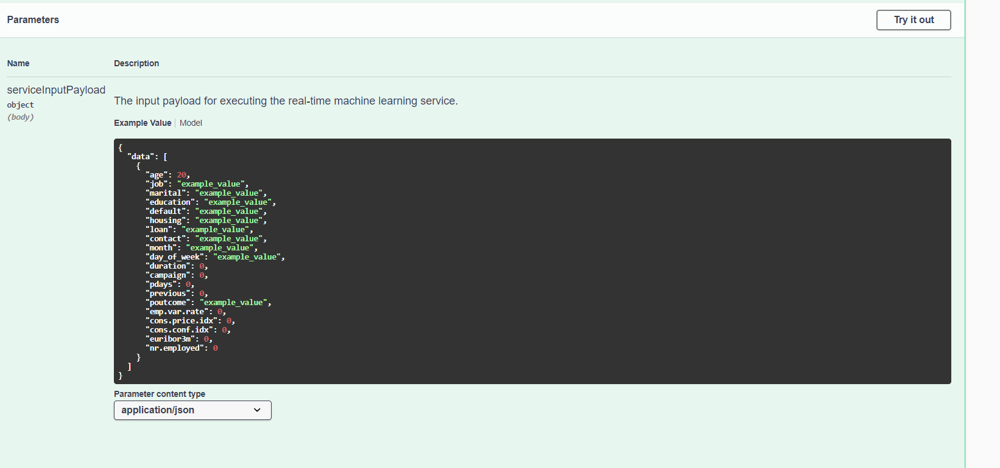

7. Consume real-time endpoint
Once the model is deploy, we can interact with it using provided file endpoint.py

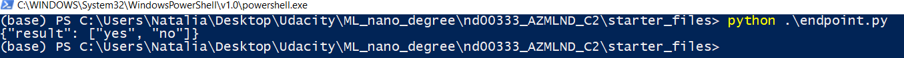
8. Create, publish and consume pipeline
At the end I created, published and consumed a pipeline:
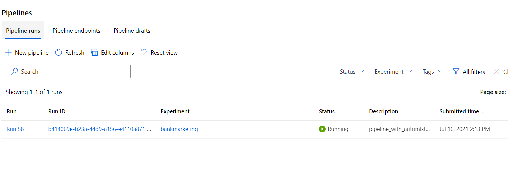
Pipeline endpoint:
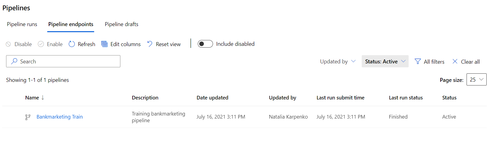
Pipeline is composed of 2 modules: dataset and AutoML module
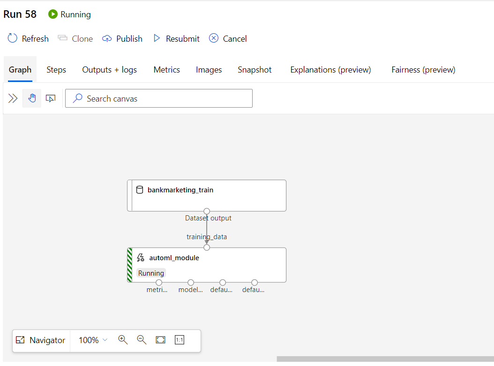
We can see the status of pipeline is "Active":
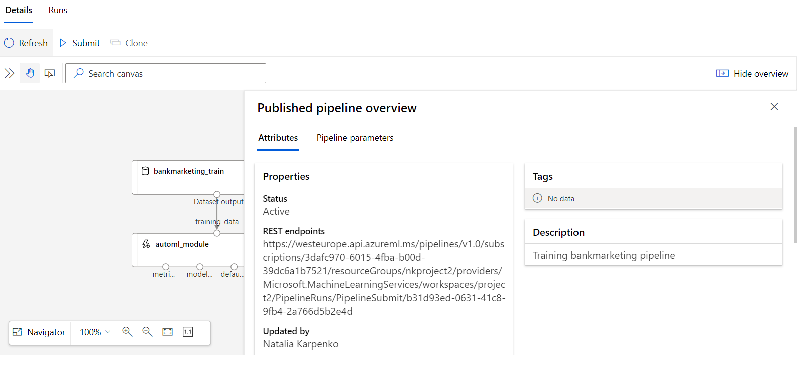

The same steps we can see in the RunDetails widget of the Notebook
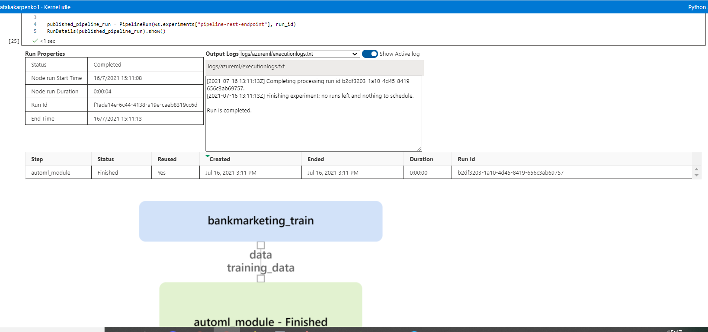
This is the pipeline status in ML Studio:
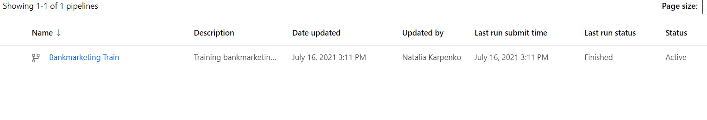

## Screen Recording
*TODO* Provide a link to a screen recording of the project in action. Remember that the screencast should demonstrate:

## Standout Suggestions
*TODO (Optional):* This is where you can provide information about any standout suggestions that you have attempted.
